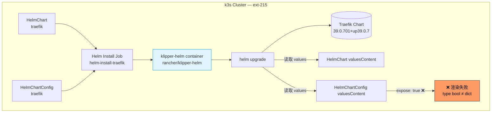
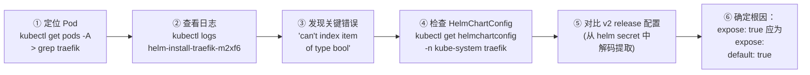
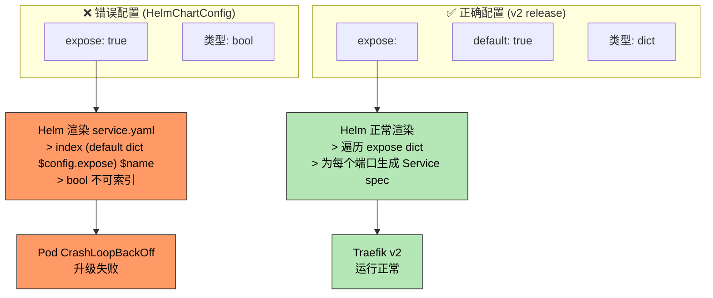
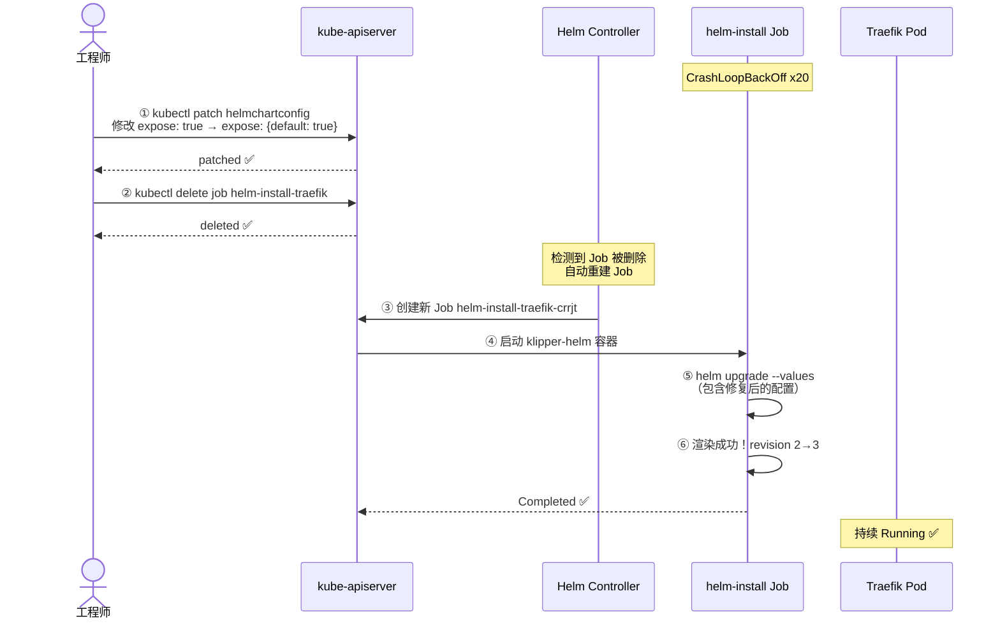
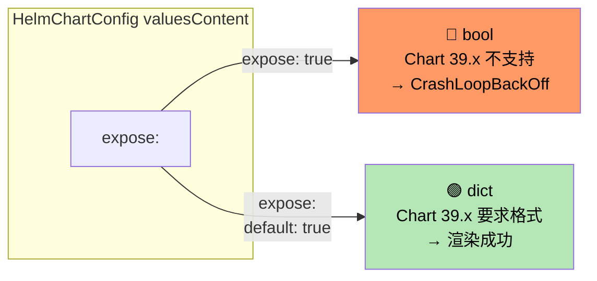

# HelmChartConfig 类型错误导致 helm-install-traefik CrashLoopBackOff

## 现象

2026-06-14 晚，发现 `kube-system` namespace 下的 `helm-install-traefik-m2xf6` Pod 处于 **CrashLoopBackOff** 状态，已重启 20 次，持续 81 分钟。Traefik Service 整体运行正常，但 Helm release 无法升级到预期的 revision。

```text
kube-system   helm-install-traefik-m2xf6   0/1   CrashLoopBackOff   20 (3m ago)   81m
kube-system   traefik-7f4bb478d7-jwwvf      1/1   Running            1 (82m ago)   4d5h
kube-system   svclb-traefik-* (×2)           3/3   Running            3 (82m ago)   4d5h
```

## 环境

- 集群：k3s v1.35.4
- 节点：ext-214 (worker), ext-215 (control-plane)
- 组件：Traefik chart 39.0.701+up39.0.7
- 容器运行时：containerd
- Helm driver：secret（k3s 默认）
- 镜像：rancher/klipper-helm:v0.9.17-build20260422

## 架构概览



## 排查过程



### Step-by-step

**① 定位问题 Pod**

`kubectl get pods --all-namespaces | grep traefik`

找到 `helm-install-traefik-m2xf6` 在 `kube-system` namespace，CrashLoopBackOff，已重启 20 次。

**② 查看日志**

```bash
kubectl logs -n kube-system helm-install-traefik-m2xf6 --tail=60
```

**③ 发现关键错误**

日志末尾明确报错：

```
Error: UPGRADE FAILED: template: traefik/templates/service.yaml:33:12:
  executing "traefik/templates/service.yaml" at <index (default dict $config.expose) $name>:
  error calling index: can't index item of type bool
```

`$config.expose` 是 **bool 值**（true/false），但 Helm chart 的 service.yaml 模板期望它是一个 **dict**，以便按端口名索引。

**④ 检查 HelmChartConfig**

```bash
kubectl get helmchartconfig -n kube-system traefik -o yaml
```

发现自定义配置：

```yaml
ports:
  redis:
    port: 6379
    expose: true     # ← 问题在这里！bool 类型
```

**⑤ 对比已成功安装的 v2 release 配置**

从 Helm secret 中解码提取当前生效配置：

```bash
kubectl get secret -n kube-system sh.helm.release.v1.traefik.v2 \
  -o jsonpath='{.data.release}' | base64 -d | base64 -d | gunzip | jq .config
```

v2 release 中的正确格式：

```yaml
ports:
  redis:
    expose:
      default: true    # ← dict 格式，chart 39.x 要求
    port: 6379
```

## 根因



**HelmChartConfig** 中自定义 `redis` 端口的 `expose` 字段使用了 **bool 类型**（`expose: true`），但 Traefik chart 39.x 要求 `expose` 是一个 **dict**（`expose: { default: true }`），用于控制每个端口的暴露行为。Chart 渲染 `service.yaml` 时执行 `index (default dict $config.expose) $name`，尝试对 bool 类型做索引操作 → 触发模板错误。

## 修复过程



### 修复命令

**Step 1 — 修改 HelmChartConfig 配置**

```bash
kubectl patch helmchartconfig -n kube-system traefik --type merge -p '{
  "spec": {
    "valuesContent": "ports:
  redis:
    port: 6379
    expose:
      default: true
"
  }
}'
```

将错误配置：
```yaml
ports:
  redis:
    port: 6379
    expose: true        # ← bool，错误
```

改为正确配置：
```yaml
ports:
  redis:
    port: 6379
    expose:
      default: true     # ← dict，正确
```

**Step 2 — 触发 Helm controller 重建 Job**

```bash
kubectl delete job -n kube-system helm-install-traefik
```

k3s 的 Helm controller 监听到 Job 被删除后，会自动使用更新后的配置重新创建 Job。

## 验证结果

- `helm-install-traefik-crrjt` — **Completed** ✅
- `traefik-7f4bb478d7-jwwvf` — **Running** ✅
- `svclb-traefik-*` (×2) — **Running** ✅
- Helm release 已从 v2 升级到 **v3**（含 redis port 6379 的正确配置）
- Helm secrets: `traefik.v1` → `traefik.v2` → `traefik.v3`

```text
secret/sh.helm.release.v1.traefik-crd.v1
secret/sh.helm.release.v1.traefik.v1
secret/sh.helm.release.v1.traefik.v2
secret/sh.helm.release.v1.traefik.v3   ← 新增
```

## 类型对比速查



## 预防措施

1. **k3s HelmChartConfig 的 `expose` 字段一律使用 dict 格式**——即使只暴露一个端口也不能简写为 `expose: true`。
2. 修改 HelmChartConfig 后，检查 klipper-helm job 日志中是否有 `can't index item of type` 这类类型错误。
3. 升级 Traefik chart 大版本时（如 38.x → 39.x），注意 `ports.*.expose` 字段类型是否有变更。
4. k3s 的 Helm controller 使用 **failurePolicy: reinstall**，配置错误不会自动跳过——必须手动修复并重建 Job。

## 相关笔记

- [k3s HelmChart 官方文档](https://docs.k3s.io/helm#using-helmchartconfig)
- [Traefik chart values 参考](https://github.com/traefik/traefik-helm-chart)
