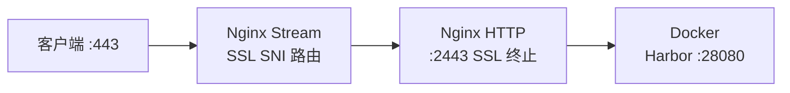
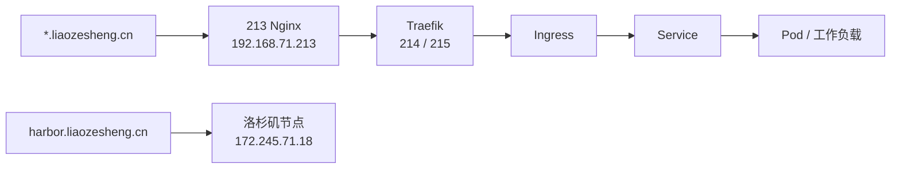
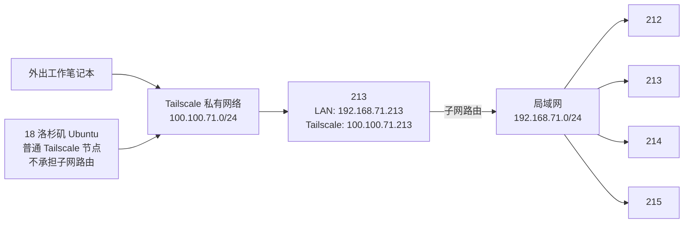

# 个人局域网环境

本文记录后续部署、排障和远程操作所依赖的个人网络环境基线。只记录已经确认的信息，设备用途等未确认内容后续补充。

## 网络基线

| 项目 | 配置 |
|---|---|
| 局域网网段 | `192.168.71.0/24` |
| 默认网关 | `192.168.71.1` |
| Tailscale 私有网段 | `100.100.71.0/24` |
| 地址分配方式 | 所有已记录设备均使用静态 IP |
| 局域网设备主 DNS | `223.5.5.5` |
| 局域网设备备用 DNS | `1.1.1.1` |

## Linux 设备

| 简称 | Hostname | 局域网 IP | 操作系统 | 登录用户 | 权限 | 网络角色 |
|---|---|---|---|---|---|---|
| `212` | `ext-212` | `192.168.71.212` | Ubuntu Linux | `zesheng` | 可使用 `sudo` | GitLab、go-ldap-admin |
| `213` | `ext-213` | `192.168.71.213` | Ubuntu Linux | `zesheng` | 可使用 `sudo` | Tailscale 子网路由器、K3s 外部入口、Docker 服务 |
| `214` | `ext-214` | `192.168.71.214` | Ubuntu Linux | `zesheng` | 可使用 `sudo` | K3s worker |
| `215` | `ext-215` | `192.168.71.215` | Ubuntu Linux | `zesheng` | 可使用 `sudo` | K3s server |

设备简称统一取局域网 IP 的最后一段，例如 `213` 表示 `192.168.71.213`。

## 远程 Linux 设备

| 简称   | 位置  | Hostname           | 公网 IP           | Tailscale IP    | ssh端口 | 系统首选 DNS            | 操作系统         | 登录用户   | 权限     |
| ---- | --- | ------------------ | --------------- | --------------- | ----- | ------------------- | ------------ | ------ | ------ |
| `18` | 洛杉矶 | `racknerd-feaf32b` | `172.245.71.18` | `100.100.71.18` | 23456 | `8.8.8.8`、`8.8.4.4` | Ubuntu Linux | `root` | `root` |

## 212 应用服务

- `212` 运行 GitLab 服务。
- `212` 使用 Docker 容器部署 `go-ldap-admin`。
- `go-ldap-admin` 用于配合 GitLab 的 LDAP 登录。

## 213 应用服务

- `213` 使用 Docker 容器部署 `fast-note-sync-service`，作为 Obsidian 同步服务。相关客户端配置见 [[Obsidian Fast Note Sync 插件配置手册]]。
- `213` 使用 Docker 容器部署 Kuboard，作为 K3s 集群管理界面。
- Kuboard 运行在 `213` 的 Docker 环境中，不属于 K3s 集群内工作负载。

## 18 应用与端口

- `18` 上的 Harbor HTTPS 入口为 `https://harbor.liaozesheng.cn`。
- 公网 `443` 端口由 Nginx stream 模块监听，通过 SNI 路由将流量转发到 Harbor。
- Harbor 实际监听在 `127.0.0.1:28080`（Docker 容器），由 Nginx 反代提供 HTTPS 访问。

### 18 Nginx 架构

- **端口 443**：Nginx stream 模块，通过 `ssl_preread` 检查 SNI，路由到本地 `:2443`
- **端口 2443**：Nginx HTTP 服务器，SSL 终止后反代到 Harbor
- **端口 28080**：Harbor Nginx 容器，实际服务端口
- 配置文件：`/etc/nginx/stream.d/reality.conf`（SNI 路由）、`/etc/nginx/conf.d/liaozesheng.conf`（反代）

## K3s 集群与访问入口

- `215` 和 `214` 组成 K3s 集群。
- `215` 是 K3s server，`214` 是 K3s worker。
- `213` 部署 Nginx，作为 K3s 集群服务的外部访问入口。
- `213` 的 Nginx 配置文件位于 `/etc/nginx/conf.d/`。

> [!important] 联合查看规则
> `213` 的 Nginx 与 K3s 集群内的 Traefik、Ingress、Service 和工作负载共同组成完整访问链路。查看配置、排查访问故障或准备变更时，必须同时核对入口机和集群两侧，不能只检查其中一方。

建议按以下顺序核对：DNS → `213` Nginx → Traefik → Ingress → Service → Pod。

### K3s 服务概况

> [!info] 检查时间
> 2026-06-24 通过 `215` 只读检查。`ext-214` 与 `ext-215` 均为 Ready，K3s 版本为 `v1.35.4+k3s1`，下列主要工作负载均处于可用状态。

| 类别 | 主要服务 | Namespace | 访问域名 |
|---|---|---|---|
| GitLab CI | GitLab Runner、`gitlab-second-pipeline` | `default` | `gitlab-second-pipeline.liaozesheng.cn` |
| 镜像仓库 | Harbor | `harbor` | `registry.liaozesheng.cn` |
| 制品仓库 | Nexus3 | `nexus` | `nexus.liaozesheng.cn` |
| 缓存 | Redis | `redis` | 无 HTTP Ingress |
| 监控 | Prometheus、Grafana、Alertmanager | `monitoring` | `prometheus.liaozesheng.cn`、`grafana.liaozesheng.cn`、`alertmanager.liaozesheng.cn` |
| 集群基础组件 | Traefik、CoreDNS、Metrics Server、Local Path Provisioner | `kube-system` | 不适用 |

- Traefik 以 LoadBalancer 形式在 `214`、`215` 上提供 `80`、`443` 和 `6379` 端口。
- Ingress 统一使用 Traefik。
- 持久化存储统一使用默认 `local-path` StorageClass；Harbor、Nexus3 和 Redis 已绑定本地持久卷。

## 阿里云 DNS

| 域名 | 解析目标 | 说明 |
|---|---|---|
| `*.liaozesheng.cn` | `192.168.71.213` | 通配符记录，指向 `213` 的 Nginx 入口 |
| `harbor.liaozesheng.cn` | `172.245.71.18` | 指向洛杉矶设备公网 IP |

## SSH 访问基线

- 本文记录的所有设备均已在服务端登记客户端公钥，可直接使用对应私钥登录。
- 所有设备统一使用默认 SSH 端口 `22`。
- 本项目的远程操作只使用密钥认证，不使用账户密码。
- 服务器端保留 `PasswordAuthentication yes` 是有意配置，不视为异常，未经明确要求不修改。
- 局域网设备使用用户 `zesheng`；洛杉矶设备使用用户 `root`。
- 禁止在远程设备上执行破坏性操作。
- 执行高风险操作前，必须向用户说明影响并获得明确确认。

## Tailscale 私有网络

日常命令、子网路由机制与排障流程见 [[Tailscale 日常使用与子网路由排障]]。

- `213` 运行 Tailscale 服务。
- `213` 在 Tailscale 私有网络中的 IP 为 `100.100.71.213`。
- 洛杉矶 Ubuntu 设备简称为 `18`，通过 Tailscale 加入私有网络，其 Tailscale IP 为 `100.100.71.18`。
- 不处于本地局域网的设备，例如外出使用的工作笔记本电脑，通过 Tailscale 加入 `100.100.71.0/24` 私有网络。
- `213` 已开启到 `192.168.71.0/24` 的子网路由。
- 只有 `213` 开启子网路由功能。`18` 仅作为普通 Tailscale 节点，不承担子网路由角色。
- 外出工作笔记本电脑可经由 `213` 的子网路由，直接访问 `192.168.71.0/24` 内的所有设备。

## 待补充信息

- 尚未说明设备的其他具体用途。
- 其他外部访问、代理及端口映射关系。
